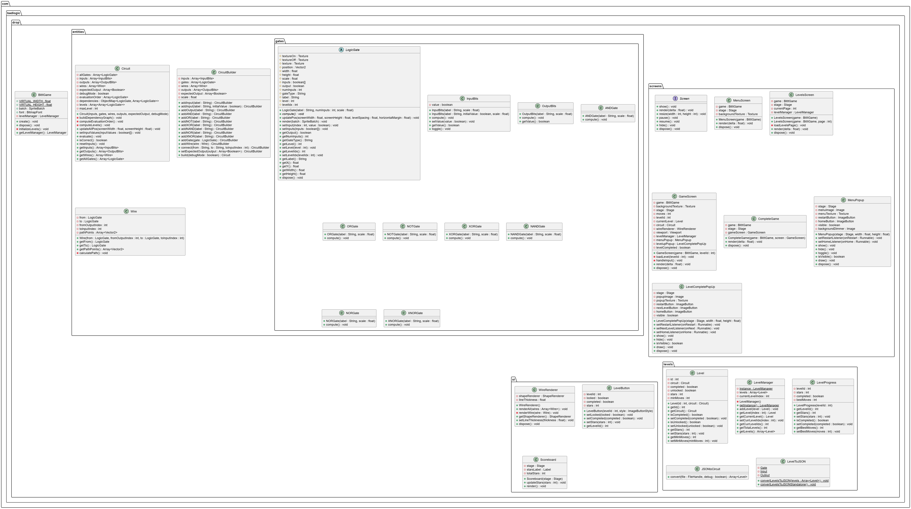
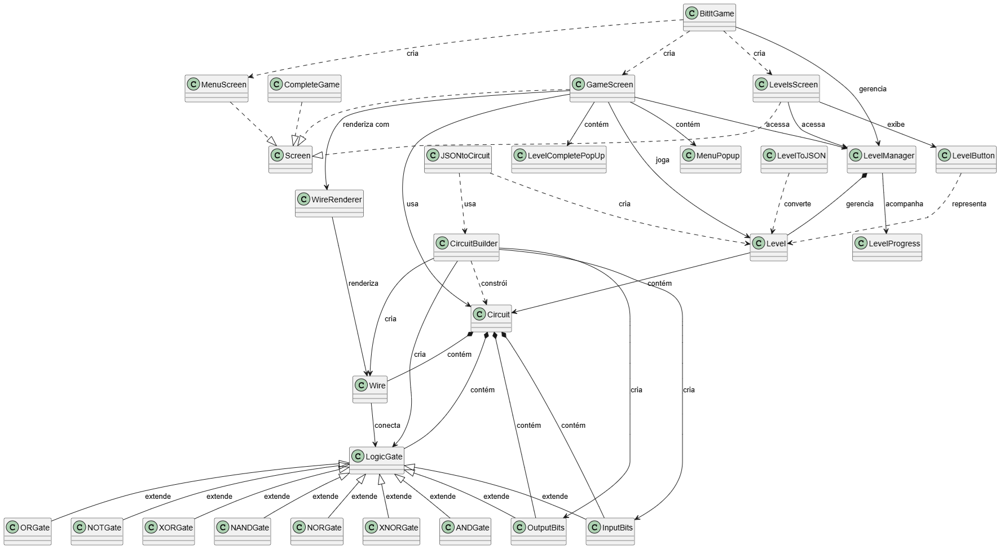

# BIT IT

Projeto final da disciplina de Paradigmas de Programação (ELC117) - UFSM

## 🙋 Integrantes

- Samuel Steffler - Ciência da Computação - <samuel.steffler@acad.ufsm.br>

- Tiago Steffler - Ciência da Computação - <tiago.steffler@acad.ufsm.br>

## ➡️ Proposta

O jogo **Bit it!** possui a proposta de ser um jogo do tipo puzzle que envolve lógica e raciocínio, onde o jogador deve interpretar um circuito lógico combinacional e inserir um código binário (composto por 0s e 1s) para avançar de nível. Cada nível apresenta um desafio diferente, com a introdução de novos elementos e complexidades à medida que o jogador progride.

Esse projeto busca aplicar os conhecimentos adquiridos na disciplina de **Paradigmas de Programação**, utilizando a linguagem Java e a biblioteca libGDX para o desenvolvimento do jogo. Foi proposto a aplicação de conceitos de **orientação a objetos** seguindo o tema da "gamificação" de uma área de interesse dos estudantes. Foi escolhido o tema de circuitos lógicos, que é um assunto relevante e interessante dentro do campo da computação.

## 🗃️ Estruturação do Jogo

O jogo é composto atualmente por 24 níveis. Cada nível é apresentado por um circuito lógico diferente, disposto na vertical tal que o jogador interage com as entradas, na parte inferior da tela, e as suas saídas são propagadas pelas portas lógicas até as saídas no topo da tela. O nível é concluído quando o resultado do circuito baseado nas entradas selecionadas corresponde à saída esperada.\
Os jogadores ganham mais estrelas ao encontrar a resposta com o menor número de interações possível, e é necessário que todos os circuitos sejam completados com pelo menos uma estrela para que um novo nível seja desbloqueado.

## ⚙️ Mecânicas de Jogo

- Introdução gradativa de novos elementos e complexidades a cada nível;
- Sistema de pontuação em estrelas baseado na quantidade de tentativas para resolver o nível;
- Navegação entre níveis anteriores para melhorar pontuação;
- Feedback visual para cada entrada inserida pelo jogador.

## 💻 Linguagens e Ferramentas Utilizadas

- **Linguagem:** Java (v2.10.8 (Oracle))
- **Biblioteca gráfica:** libGDX (v1.13.0)
- **Configuração de build:** Gradle (v8.10)
- **Ambiente de desenvolvimento utilizado:** Visual Studio Code
- **Ferramente de edição de imagens:** GIMP, Inskcape e Canva
- **Criação e simulação dos circuitos:** Logisim Web

## 📝 Desenvolvimento

- **[CHANGELOG](CHANGELOG.md)** - Histórico de alterações e versões do projeto

O desenvolvimento do jogo aconteceu durante a metade final da disciplina, amjoritariamente no mês de novembro de 2025. Nós realizamos testes individuais em cada máqina e o código fio sendo atualizado pelo GitHub. Houve também a utilização de programação síncrona por meio de um plug-in de compartilhamento de código no Visual Studio Code, o que facilitou a colaboração em tempo real. Todo o progresso foi documentado no changelog, detalhando todas as modificações realizadas.

A parte gráfica envolvendo os elementos de circuito, como portas lógicas e bits de entrada e saída, foram desenhados pelo Samuel utilizando Inkscape. Tiago foi responsável por criar os Layouts e o restante dos elementos gráficos de interface utlizando Canva e GIMP.

Enquanto que Samuel focou o seu desenvolvimento na parte de criação da lógica do jogo, evaluação do circuito e renderização correta, Tiago foi encarregado de desenvolver a interface com navegabilidade entre menus, além de desenvolver o sistema de parsing dos níveis de texto escrito para JSON.

A dificuldade extrema até o momento da entrega final (e não completamente solucionada) é a criação de um algoritmo inteligente de roteamento dos fios - que foi significativamente melhorado, mas apresenta algumas falhas em níveis mais complexos ou em casos específicos.

A documentação do código foi feita em conjunto, assim como os testes e correção de bugs na etapa final do projeto.

## ❔ Como Jogar

O jogador deve observar o circuito lógico apresentado na tela, que inclui portas lógicas (AND, OR, NOT, etc.) e conexões entre elas. Com base na análise do circuito, o jogador deve inserir uma sequência de bits (0s e 1s) que representem a entrada correta para o circuito. Quando a combinação correta é inserida, o jogador avança para o próximo nível.

A tela inicial permite o acesso ao menu de níveis, configurações e instruções do jogo. Durante o jogo, o jogador pode reiniciar o nível ou retornar ao menu principal.

Interface foi adaptada para utilização tanto em desktop quanto em dispositivos móveis, assim como executando localmente ou pela web.

## 🖼️ Galeria de Imagens

<div style="display:flex; gap:18px; justify-content:center; align-items:flex-start; flex-wrap:wrap;">
 <figure style="text-align:center; margin:0;">
  
  <figcaption>Tela inicial do jogo</figcaption>
 </figure>

 <figure style="text-align:center; margin:0;">
  
  <figcaption>Tela de níveis com pontuação de níveis já desbloqueados</figcaption>
 </figure>

 <figure style="text-align:center; margin:0;">
  
  <figcaption>Tela durante o jogo</figcaption>
 </figure>

 <figure style="text-align:center; margin:0;">
  
  <figcaption>Pop-up de vitória — três estrelas</figcaption>
 </figure>

 <figure style="text-align:center; margin:0;">
  
  <figcaption>Circuitos desenvolvidos pelo LogiSim para implementação no jogo</figcaption>
 </figure>
</div>

## Diagrama de Classes

O diagrama foi separado em duas partes para facilitar a sua visualização. A primeira imagem apresenta todas as classes, seus atributos, métodos e o pacote em que estão inseridas. A segunda imagem mostra todas as relações entre essas diferentes classes, assim como relações de herança, implementação e uso:

\


## Como compilar

- Primeiramente, clonar o repositório utilizando o seguinte link:

  ```
  https://github.com/elc117/gamification-2025b-samuel-tiago-steffler.git
  ```
  
- Abrir um terminal na raiz do repositório e executar os seguintes comandos:
  
  ```terminal
    cd \gdx-1.13.0\a-simple-game\
    .\gradlew lwjgl3:build lwjgl3:run
  ```

- Para criação de versão HTML (acessada via ```localhost:8000```):
  
  ```terminal
    .\gradlew html:dist
    cd \html\build\dist\
    python -m http.server 
  ```


## Resultado Final


<div style="display:flex; gap:18px; justify-content:center; align-items:flex-start; flex-wrap:wrap;">
 <figure style="text-align:center; margin:0;">
  
  <figcaption>Tela inicial e tutorial</figcaption>
 </figure>
  <figure style="text-align:center; margin:0;">
  
  <figcaption>Exemplo de gameplay</figcaption>
 </figure>
</div>


## Referências

[A Simple Game - libGDX Wiki](https://libgdx.com/wiki/start/a-simple-game) - Exemplo base utilizado para iniciar o desenvolvimento do jogo\
[libGDX wiki](https://libgdx.com/wiki/) - Muito consultado para encontrar métodos úteis como os de logging, por exemplo\
[Logisim Web](https://logisim.app) - Versão do Logisim que roda no navegador, usado para criação e teste de circuitos\
Materiais de aula, como [esse](https://liascript.github.io/course/?https://raw.githubusercontent.com/AndreaInfUFSM/elc117-2025b/main/classes/24a/README.md#1), [esse](https://liascript.github.io/course/?https://raw.githubusercontent.com/AndreaInfUFSM/elc117-2025b/main/classes/24a/README.md#1) e [esse](https://liascript.github.io/course/?https://raw.githubusercontent.com/AndreaInfUFSM/elc117-2025b/main/classes/23/README.md#1).\
Claude Sonnet 4.5, mais especificamente ideias de criação de circuitos como níveis e dúvidas pontuais sobre parsing JSON (nenhum foi salvo no processo de desenvolvimento do jogo).
